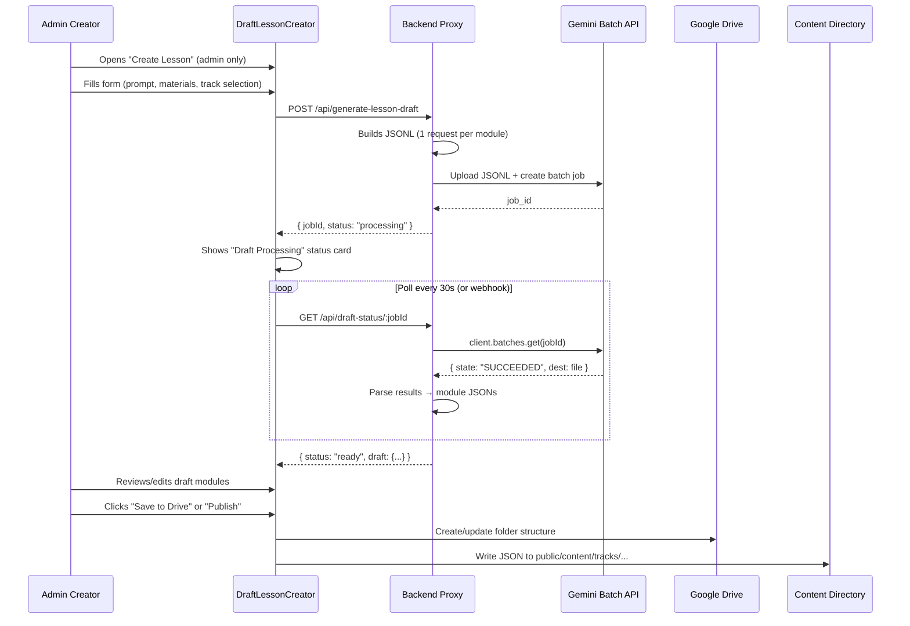
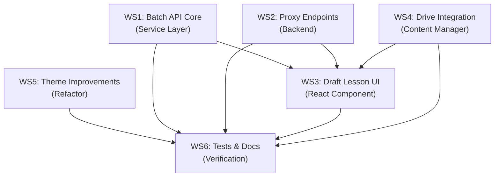

# Implementation Plan: Draft Lesson Generator + Theme Improvements

## Executive Summary

Two initiatives for the course-catalog platform:

1. **Draft Lesson Generator** — Admin-only in-app tool that lets authenticated creators generate complete course drafts from a prompt + reference materials, using the **Gemini Batch API** for 50% cost savings. Supports adding to existing tracks or creating new ones, with Google Drive folder integration.

2. **Theme Generation Improvements** — Response validation, caching layer, configurable model selection, and pre-generation of popular theme palettes.

> [!IMPORTANT]
> The Batch API is **asynchronous** (results within 24 hours, typically minutes). This means the lesson generator UX must be designed as a "submit job → check status → review draft" workflow, not instant results. This is actually a better UX for content creation — it lets creators submit, walk away, and come back to review.

---

## Part 1: Draft Lesson Generator

### 1.1 User Flow



### 1.2 Feature Requirements

| Requirement | Details |
|-------------|---------|
| **Auth gate** | Only users with `role === 'admin'` (via existing `roleManager.js`) can access |
| **Track selection** | Dropdown of existing tracks from `catalog.json` + "Create New Track" option |
| **Course ID** | Auto-generated slug from title (e.g., "Intro to Kubernetes" → `k8s-101`) or manual override |
| **Prompt input** | Rich textarea for describing the course topic, target audience, depth level |
| **Reference materials** | Support: (a) URL links to docs/articles, (b) file upload (PDF, MD, TXT), (c) Google Doc link |
| **Module count** | Slider or input: how many modules to generate (default 5) |
| **Module types** | Checkbox: include "Check Your Understanding" quizzes per module |
| **Output format** | Must produce valid `metadata.json`, `manifest.json`, and `modules/*.json` matching existing schemas |
| **Draft review** | In-app preview of generated modules before saving |
| **Drive integration** | Check if track/course folder exists in Drive; create if not |
| **Status tracking** | Persistent draft jobs stored in localStorage with Drive sync |

### 1.3 Technical Architecture

#### New Files to Create

| File | Purpose |
|------|---------|
| `src/components/DraftLessonCreator.jsx` | Main UI component — form, status tracker, draft preview |
| `src/services/lessonDraftService.js` | Client-side service — submit jobs, poll status, parse results |
| `src/services/batchApiClient.js` | Batch API abstraction — JSONL builder, job management |
| `src/services/driveContentManager.js` | Extended Drive ops — create folders, upload content JSONs |
| `src/__tests__/services/lessonDraftService.test.js` | Unit tests for draft service |
| `src/__tests__/services/batchApiClient.test.js` | Unit tests for batch client |
| `src/__tests__/components/DraftLessonCreator.test.jsx` | Component tests |

#### Files to Modify

| File | Change | Risk |
|------|--------|------|
| [App.jsx](file:///var/home/wtg/Repos/course-catalog/src/App.jsx#L891-L896) | Add route: `/admin/create-lesson` → `DraftLessonCreator` | **LOW** — additive route only |
| [AdminPanel.jsx](file:///var/home/wtg/Repos/course-catalog/src/components/AdminPanel.jsx) | Add "Create Lesson Draft" button linking to new route | **LOW** — additive UI only |
| [gemini_proxy.js](file:///var/home/wtg/Repos/course-catalog/scripts/gemini_proxy.js) | Add 3 endpoints: `/generate-lesson-draft`, `/draft-status/:id`, `/draft-results/:id` | **LOW** — new endpoints, existing ones untouched |
| [functions/theme-proxy/index.js](file:///var/home/wtg/Repos/course-catalog/functions/theme-proxy/index.js) | Add same 3 endpoints for production Cloud Function | **LOW** — same pattern |
| [functions/theme-proxy/package.json](file:///var/home/wtg/Repos/course-catalog/functions/theme-proxy/package.json) | Add `@google/genai` SDK dependency for Batch API | **LOW** — new dep |
| [googleAuth.js](file:///var/home/wtg/Repos/course-catalog/src/services/googleAuth.js#L16) | No change needed — already has `generative-language` + `drive.file` scopes | **NONE** |
| [catalog.json](file:///var/home/wtg/Repos/course-catalog/public/content/catalog.json) | May be modified if "Create New Track" is used | **LOW** — only when creating new track |
| [AGENTS.md](file:///var/home/wtg/Repos/course-catalog/AGENTS.md) | Document new feature, components, and endpoints | **NONE** |
| [TODO.md](file:///var/home/wtg/Repos/course-catalog/TODO.md) | Add Draft Lesson Generator phase | **NONE** |

#### Proxy Endpoint Design

```
POST /api/generate-lesson-draft
  Body: { prompt, materials: [{type, content}], trackId, courseId, moduleCount, includeQuizzes }
  Response: { jobId, status: "processing", estimatedModules: 5 }

GET /api/draft-status/:jobId
  Response: { status: "processing"|"succeeded"|"failed", progress: "3/5 modules" }

GET /api/draft-results/:jobId
  Response: { metadata: {...}, manifest: {...}, modules: [{...}, ...] }
```

#### JSONL Batch Request Structure

Each line in the JSONL file is one module generation request:

```jsonl
{"request":{"model":"models/gemini-2.5-flash","contents":[{"role":"user","parts":[{"text":"Generate module 1 of 5 for course..."}]}],"systemInstruction":{"parts":[{"text":"You are a course content generator..."}]},"generationConfig":{"temperature":0.7,"responseMimeType":"application/json"}},"metadata":{"moduleIndex":0,"courseId":"k8s-101"}}
{"request":{"model":"models/gemini-2.5-flash","contents":[{"role":"user","parts":[{"text":"Generate module 2 of 5 for course..."}]}],"systemInstruction":{"parts":[{"text":"You are a course content generator..."}]},"generationConfig":{"temperature":0.7,"responseMimeType":"application/json"}},"metadata":{"moduleIndex":1,"courseId":"k8s-101"}}
```

### 1.4 System Instruction for Module Generation

The system instruction will enforce the exact JSON schema the platform expects:

```
You are a professional course curriculum developer for the tridorian learning platform.
Generate a single course module in STRICT JSON format matching this schema:

{
  "id": "string (module index as string, e.g. '1')",
  "title": "string (numbered title, e.g. '1. Introduction to Kubernetes')",
  "type": "lab",
  "blocks": [
    // Array of content blocks using ONLY these types:
    // h1, h2, h3, p, code, list, grid, info, warning, collapsible, slides, video
    // Each block has "type" and "content" (string) or type-specific fields
  ]
}

Rules:
- Start with an h1 block as the module title
- Include 8-15 content blocks per module
- Use code blocks with "language" and "code" fields for examples
- Use grid blocks with "items" array for feature overviews
- Include an info block for pro-tips
- If quizzes are requested, end with h2 "Check Your Understanding" + 2-3 questions
  using the exact format: Question as p block, options as p block with "- A) ...", feedback as p block
- Return ONLY the raw JSON object, no markdown wrapping
```

---

## Part 2: Theme Generation Improvements

### 2.1 Current Problems Identified

| Problem | File | Impact |
|---------|------|--------|
| No response validation | [themeGenerator.js L161](file:///var/home/wtg/Repos/course-catalog/src/services/themeGenerator.js#L161) | Malformed JSON from Gemini crashes the app |
| No caching | All theme gen files | Identical prompts waste API calls |
| Hardcoded model name | [themeGenerator.js L119](file:///var/home/wtg/Repos/course-catalog/src/services/themeGenerator.js#L119) | Can't upgrade models without code change |
| Duplicated system instruction | [themeGenerator.js L80](file:///var/home/wtg/Repos/course-catalog/src/services/themeGenerator.js#L80), [gemini_proxy.js L87](file:///var/home/wtg/Repos/course-catalog/scripts/gemini_proxy.js#L87), [theme-proxy/index.js L60](file:///var/home/wtg/Repos/course-catalog/functions/theme-proxy/index.js#L60) | Same 30-line prompt copied 3x — maintenance risk |
| No request deduplication | Client-side | Rapid double-clicks send duplicate API calls |
| No graceful degradation | `generateImageWithImagen` | 3-model fallback chain is good, but no similar pattern for theme gen |

### 2.2 Improvements

| Improvement | Approach | Savings |
|-------------|----------|---------|
| **JSON schema validation** | Validate all 16 required keys exist before applying theme; if missing keys, use fallback defaults | Prevents crashes |
| **Prompt-hash caching** | SHA-256 hash of prompt → cache in localStorage with 24h TTL; skip API if cached | Eliminates repeat calls |
| **Shared system instruction** | Extract to `src/services/themePrompts.js` — single source of truth for all 3 locations | Maintenance |
| **Configurable model** | `VITE_GEMINI_MODEL` env var, defaults to `gemini-2.5-flash` | Future-proofing |
| **Request deduplication** | In-flight promise tracking — if same prompt is already pending, return same promise | Prevents double-spend |
| **Batch pre-generation** | Build script that pre-generates 10 popular theme palettes via Batch API, ships as static JSON | Eliminates runtime cost for common themes |

### 2.3 Theme Improvement Files

| File | Change |
|------|--------|
| **NEW** `src/services/themePrompts.js` | Shared system instructions for theme, music, image generation |
| **NEW** `src/services/themeCache.js` | LocalStorage cache with SHA-256 prompt hashing and TTL |
| **NEW** `scripts/prebuild-themes.js` | Build script to pre-generate popular themes via Batch API |
| **MODIFY** [themeGenerator.js](file:///var/home/wtg/Repos/course-catalog/src/services/themeGenerator.js) | Import shared prompts, add cache check, add validation, add dedup |
| **MODIFY** [gemini_proxy.js](file:///var/home/wtg/Repos/course-catalog/scripts/gemini_proxy.js) | Import shared prompts, add configurable model |
| **MODIFY** [functions/theme-proxy/index.js](file:///var/home/wtg/Repos/course-catalog/functions/theme-proxy/index.js) | Import shared prompts, add configurable model |

---

## Part 3: Sub-Agent Task Breakdown

### Workstream Overview



---

### WS1: Batch API Core Service Layer
**Agent Role: Backend Service Engineer**

- [ ] **T1.1** Create `src/services/batchApiClient.js`
  - `buildModuleJSONL(prompt, materials, moduleCount, courseId)` — builds JSONL string with one request per module
  - `submitBatchJob(jsonlContent)` — uploads JSONL via proxy and creates batch job
  - `checkJobStatus(jobId)` — polls batch job state
  - `downloadResults(jobId)` — downloads and parses results into module JSON objects
  - Error handling for all Batch API failure states

- [ ] **T1.2** Create `src/services/lessonDraftService.js`
  - `createDraft(options)` — orchestrates the full flow: build JSONL → submit → track
  - `getDraftStatus(jobId)` — wrapper around batch status check
  - `getDraftResults(jobId)` — parses results into platform-compatible format (metadata, manifest, modules)
  - `saveDraftToLocalStorage(jobId, draft)` — persists draft state locally
  - `listDrafts()` — returns all in-progress and completed drafts
  - `deleteDraft(jobId)` — cleanup

- [ ] **T1.3** Create system instruction constants in `src/services/lessonPrompts.js`
  - Module generation system prompt (enforcing JSON schema)
  - Metadata generation prompt
  - Quiz generation sub-prompt
  - Include reference material injection template

**Depends on:** Nothing
**Estimated complexity:** Medium

---

### WS2: Backend Proxy Endpoints
**Agent Role: Backend API Engineer**

- [ ] **T2.1** Add Batch API endpoints to `scripts/gemini_proxy.js`
  - `POST /generate-lesson-draft` — accepts prompt/materials, builds JSONL, submits batch job
  - `GET /draft-status/:jobId` — returns job state
  - `GET /draft-results/:jobId` — downloads and returns parsed results
  - In-memory job tracking map for active jobs

- [ ] **T2.2** Add same endpoints to `functions/theme-proxy/index.js` (Cloud Function)
  - Same 3 endpoints with ADC authentication
  - Add `@google/genai` SDK to `functions/theme-proxy/package.json`
  - Use Cloud Storage or Firestore for job tracking (instead of in-memory for serverless)

- [ ] **T2.3** Add admin auth check to proxy endpoints
  - Verify the caller's OAuth token has admin role before processing
  - Return 403 for non-admin users

**Depends on:** Nothing (parallel with WS1)
**Estimated complexity:** Medium-High

---

### WS3: Draft Lesson Creator UI
**Agent Role: Frontend React Engineer**

- [ ] **T3.1** Create `src/components/DraftLessonCreator.jsx`
  - Admin role gate (redirect if not admin)
  - Form: course title, prompt textarea, module count slider (1-10), quiz toggle
  - Track selector dropdown (existing tracks from catalog + "New Track")
  - New Track sub-form: track ID, title, description, icon (Lucide icon picker)
  - Reference materials section: URL input list + file upload dropzone
  - Submit button → calls `lessonDraftService.createDraft()`

- [ ] **T3.2** Draft status & review panel
  - Active job status card (processing animation, module progress)
  - Draft list showing all past/current drafts
  - Module preview: renders each generated module using existing `ContentRenderer.jsx`
  - Edit mode: inline JSON editor for each module block
  - "Save to Drive" and "Publish to Catalog" action buttons

- [ ] **T3.3** Add route and navigation
  - Add `<Route path="/admin/create-lesson" />` to `App.jsx`
  - Add "Create Lesson Draft" button to `AdminPanel.jsx`
  - Breadcrumb: Admin → Create Lesson Draft

- [ ] **T3.4** Style with Tailwind matching existing tridorian theme
  - Use existing CSS variables: `bg-base`, `bg-panel`, `accent-bg`, `text-main`, etc.
  - Terminal-aesthetic form inputs
  - Processing animation using theme accent color

**Depends on:** WS1 (services), WS2 (proxy endpoints)
**Estimated complexity:** High

---

### WS4: Google Drive Content Manager
**Agent Role: Drive Integration Engineer**

- [ ] **T4.1** Create `src/services/driveContentManager.js`
  - `findOrCreateTrackFolder(trackId)` — searches Drive for existing track folder, creates if missing
  - `findOrCreateCourseFolder(trackId, courseId)` — same for course folder
  - `uploadModuleFiles(trackId, courseId, modules)` — uploads all module JSONs to Drive
  - `uploadManifest(trackId, courseId, manifest)` — uploads manifest.json
  - `uploadMetadata(trackId, courseId, metadata)` — uploads metadata.json
  - Uses existing `driveFetch` pattern from [googleDrive.js](file:///var/home/wtg/Repos/course-catalog/src/services/googleDrive.js)

- [ ] **T4.2** Publish to local content directory
  - `publishToContentDir(trackId, courseId, draft)` — writes files to `public/content/tracks/...`
  - Updates `catalog.json` if new track was created
  - Updates `track.json` with new course entry
  - This is the "local publish" path for preview/development

- [ ] **T4.3** Wire up Drive sync with draft flow
  - After "Save to Drive" action, call Drive manager
  - Sync draft status to Drive progress file (reusing `syncProgressToDrive()`)

**Depends on:** WS1 (draft output format)
**Estimated complexity:** Medium

---

### WS5: Theme Generation Improvements
**Agent Role: Refactoring Engineer**

- [ ] **T5.1** Extract shared system instructions
  - Create `src/services/themePrompts.js` with exported constants:
    - `THEME_SYSTEM_INSTRUCTION` (the 30-line prompt)
    - `MUSIC_PROMPT_TEMPLATE`
    - `IMAGE_PROMPT_TEMPLATE`
  - Update all 3 consumers to import from this file:
    - `src/services/themeGenerator.js`
    - `scripts/gemini_proxy.js`
    - `functions/theme-proxy/index.js`

- [ ] **T5.2** Add JSON response validation
  - Create `validateThemeResponse(json)` in `themePrompts.js`
  - Checks all 16 required keys exist
  - Validates hex color format for color fields
  - Validates music config structure
  - Falls back to sensible defaults for missing fields
  - Apply in all 3 locations after `JSON.parse()`

- [ ] **T5.3** Add prompt-hash caching
  - Create `src/services/themeCache.js`
  - SHA-256 hash of prompt text → lookup in localStorage
  - 24-hour TTL per cached entry
  - Cache invalidation on explicit regenerate
  - Apply in `generateThemeWithGemini()` before API call

- [ ] **T5.4** Add request deduplication
  - In-flight promise map keyed by prompt hash
  - If same prompt is already pending, return existing promise
  - Clear from map on resolve/reject

- [ ] **T5.5** Make model name configurable
  - Read from `import.meta.env.VITE_GEMINI_MODEL` or `process.env.GEMINI_MODEL`
  - Default to `gemini-2.5-flash`
  - Apply in all 3 locations

- [ ] **T5.6** Create `scripts/prebuild-themes.js`
  - Pre-generates 10 popular theme palettes via Batch API
  - Outputs to `public/content/themes/prebuilt.json`
  - Run as build step or manually
  - Client loads prebuilt themes first; only calls API for custom prompts

**Depends on:** Nothing (fully independent)
**Estimated complexity:** Medium

---

### WS6: Tests, Docs & Verification
**Agent Role: QA & Documentation Engineer**

- [ ] **T6.1** Unit tests for new services
  - `src/__tests__/services/batchApiClient.test.js` — JSONL building, job status parsing
  - `src/__tests__/services/lessonDraftService.test.js` — full flow with mocked batch API
  - `src/__tests__/services/driveContentManager.test.js` — Drive folder creation, file upload
  - `src/__tests__/services/themeCache.test.js` — cache hit/miss, TTL expiry
  - `src/__tests__/services/themePrompts.test.js` — validation function tests

- [ ] **T6.2** Component tests
  - `src/__tests__/components/DraftLessonCreator.test.jsx` — form rendering, submit flow, status display

- [ ] **T6.3** Integration verification
  - Run `npx vitest run` — all 14+ existing tests must still pass
  - Manually verify: Dashboard renders, course navigation works, theme generator works
  - Verify no import cycles or missing dependencies

- [ ] **T6.4** Documentation updates
  - Update [AGENTS.md](file:///var/home/wtg/Repos/course-catalog/AGENTS.md) with new components, services, routes
  - Update [TODO.md](file:///var/home/wtg/Repos/course-catalog/TODO.md) with new phase
  - Update [CONTENT_GUIDE.md](file:///var/home/wtg/Repos/course-catalog/docs/CONTENT_GUIDE.md) with draft generator instructions
  - Update [README.md](file:///var/home/wtg/Repos/course-catalog/README.md) with Batch API setup

**Depends on:** WS1-WS5 (tests all changes)
**Estimated complexity:** Medium

---

## Part 4: Risk Analysis & Safety Checks

### Zero-Regression Checklist

| Existing Feature | Risk | Mitigation |
|------------------|------|------------|
| Content loading | **NONE** — `contentLoader.js` is unchanged | No file touched |
| Theme generator | **LOW** — refactoring prompt extraction, adding cache | Cache is additive; validation is additive; shared prompts are a refactor of constants only |
| Google Drive sync | **NONE** — `googleDrive.js` is unchanged | New `driveContentManager.js` is separate; reuses `driveFetch` pattern |
| OAuth flow | **NONE** — `googleAuth.js` is unchanged | Already has all needed scopes |
| Role manager | **NONE** — `roleManager.js` is unchanged | Draft feature just reads `checkUserRole()` |
| Quiz parser | **NONE** — `quizParser.js` is unchanged | Generated modules use same quiz format |
| Routing | **LOW** — adding new route only | New route `/admin/create-lesson` doesn't conflict with existing patterns |
| Existing tests | **NONE** — no existing test files modified | New tests are additive |
| Build process | **NONE** — `vite.config.js` unchanged | New components auto-discovered by Vite |
| Cloud Function | **LOW** — adding new endpoints to existing function | New paths, existing paths untouched |

### Dependency Safety

| New Dependency | Where | Why |
|----------------|-------|-----|
| `@google/genai` (Google AI SDK) | `functions/theme-proxy/package.json` only | Required for Batch API — `client.batches.create()`, `client.files.upload()` |

> [!NOTE]
> The main `package.json` does **NOT** need the Google AI SDK. The client-side code talks to the proxy, and the proxy handles Batch API calls. This keeps the client bundle clean.

### Batch API Limitations to Handle

| Limitation | Handling |
|------------|----------|
| 24-hour max completion time | Show "typically completes in minutes" + progress indicator |
| JSONL format required | `batchApiClient.js` handles JSONL building |
| 2GB max file size | Not a concern — even 100 modules is ~200KB of JSONL |
| Results in JSONL format | Parse each line as separate module response |
| Job may fail partially | Handle per-line errors; show which modules succeeded/failed |

---

## Part 5: Execution Order

```
Phase 1 (Parallel):
  ├── WS1: Batch API Core (T1.1 → T1.2 → T1.3)
  ├── WS2: Proxy Endpoints (T2.1 → T2.2 → T2.3)
  ├── WS4: Drive Content Manager (T4.1 → T4.2)
  └── WS5: Theme Improvements (T5.1 → T5.2 → T5.3 → T5.4 → T5.5)

Phase 2 (After Phase 1):
  ├── WS3: Draft Lesson UI (T3.1 → T3.2 → T3.3 → T3.4)
  └── WS4: T4.3 (wire up Drive with draft flow)

Phase 3 (After Phase 2):
  ├── WS5: T5.6 (prebuild themes script — uses batch API from WS1)
  └── WS6: Tests & Docs (T6.1 → T6.2 → T6.3 → T6.4)
```

### Recommended Sub-Agent Assignments

| Sub-Agent # | Workstreams | Branch Name |
|-------------|-------------|-------------|
| **Agent 1** | WS1 + WS2 (Batch API core + proxy endpoints) | `feature/batch-api-lesson-generator-backend` |
| **Agent 2** | WS5 (Theme improvements) | `feature/theme-generation-improvements` |
| **Agent 3** | WS4 (Drive content manager) | `feature/drive-content-manager` |
| **Agent 4** | WS3 (Draft Lesson UI — after agents 1-3 finish) | `feature/draft-lesson-creator-ui` |
| **Agent 5** | WS6 (Tests & documentation — final) | `feature/tests-and-docs` |

> [!TIP]
> Agents 1, 2, and 3 can run in **parallel** since they touch different files. Agent 4 depends on their output. Agent 5 runs last to verify everything.
