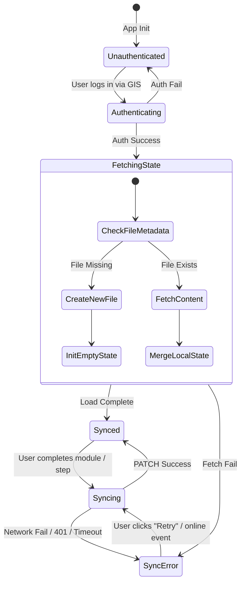

# Phase 4: State Persistence & Google Drive Sync Design Specification

This architecture document specifies the technical design, schemas, and integration plans for implementing Google Drive state persistence and automated content synchronization (CI/CD) for the Tridorian Course Platform.

---

## 1. Progress State Schema Design

To track learner progress across multiple tracks, courses, modules, and steps, we establish a robust schema. We leverage a **hybrid storage design** that balances the lightweight speed of Google Drive metadata (`appProperties`) with the unlimited scalability of a dedicated JSON progress file (`agv_course_progress.json`).

### 1.1 Architecture Decision: Progress Storage Mechanism
We evaluated two primary approaches for storing state in Google Drive:
1. **Google Drive `appProperties` API only**: Limits key-value pairs to 100 properties, with each pair (key + value) capped at 124 bytes.
2. **JSON Progress File in App Data Folder only**: Requires separate download and media upload API calls, resulting in minor latency overhead.

**Recommendation: The Hybrid Approach**
We will store the comprehensive progress state in a hidden JSON file (`agv_course_progress.json`) in the user's Google Drive `appDataFolder` (a private sandbox folder inaccessible to users directly in the Drive Web UI). Concurrently, we will update the file's metadata `appProperties` to store the *active session state* and a *last updated timestamp*. 

This provides:
- **Fast Resumes:** The app can fetch file metadata (single fast API request) to check the active session and see if sync is required.
- **Unlimited Scalability:** Progress tracking across dozens of tracks and courses is stored in the JSON file body, completely bypassing the 124-byte limit.

---

### 1.2 Schema Definitions

#### A. Progress File Body (`agv_course_progress.json` content)
Stored inside the Google Drive `appDataFolder`, the file content conforms to the following schema:

```json
{
  "activeSession": {
    "trackId": "agentic-engineering",
    "courseId": "agv-101",
    "moduleId": "3",
    "lastUpdated": "2026-06-02T21:15:00.000Z"
  },
  "courses": {
    "agentic-engineering/agv-101": {
      "completedModules": ["1", "2", "3"],
      "lastUpdated": "2026-06-02T21:15:00.000Z"
    },
    "agentic-engineering/gemini-cli": {
      "completedModules": ["1", "2"],
      "lastUpdated": "2026-06-02T21:10:00.000Z"
    }
  }
}
```

#### B. File Metadata properties (`appProperties` on the Drive File Object)
To support rapid verification without fetching the entire file content, the following metadata keys are updated on the Google Drive file object whenever progress changes:

| Key | Format | Example Value | Description |
|---|---|---|---|
| `activeTrackId` | String | `agentic-engineering` | The ID of the last active track. |
| `activeCourseId` | String | `agv-101` | The ID of the last active course. |
| `activeModuleId` | String | `3` | The ID of the last active module. |
| `lastUpdated` | ISO-8601 | `2026-06-02T21:15:00.000Z` | Timestamp used for conflict resolution. |

---

## 2. Google Drive Integration Service (`googleDrive.js`)

We will refine `src/services/googleDrive.js` to implement progress fetching, saving, offline queuing, and conflict resolution.

```
┌─────────────────────────────────────────────────────────────┐
│                       React UI / App                        │
└──────────────────────────────┬──────────────────────────────┘
                               │
               ┌───────────────┴───────────────┐
               ▼                               ▼
       [readProgress]                   [saveProgress]
               │                               │
               ▼                               ▼
┌─────────────────────────────────────────────────────────────┐
│                  src/services/googleDrive.js                │
├─────────────────────────────────────────────────────────────┤
│  • Memory Cache / localStorage Cache                        │
│  • Offline queue                                            │
│  • Conflict resolver (LWW + Union)                          │
└──────────────────────────────┬──────────────────────────────┘
                               │
                ┌──────────────┴──────────────┐
                ▼ (fetch)                     ▼ (fetch)
┌──────────────────────────────┐┌─────────────────────────────┐
│     GIS (googleAuth.js)      ││      Google Drive API       │
│     Token Client & State     ││   (appdata scope endpoints) │
└──────────────────────────────┘└─────────────────────────────┘
```

### 2.1 Refined API Interface

```javascript
/**
 * Initial load of progress. Fetches from Drive and merges with localStorage.
 * Automatically handles file creation if it does not exist.
 * @returns {Promise<Object>} The resolved progress state object.
 */
export async function loadProgress();

/**
 * Persists the current session state and completed modules to Drive.
 * If offline, saves to local storage and queues for later sync.
 * @param {string} trackId - Active track ID
 * @param {string} courseId - Active course ID
 * @param {string} moduleId - Active module ID
 * @param {Array<string>} completedModules - Array of completed module IDs for the course
 * @returns {Promise<void>}
 */
export async function persistProgress(trackId, courseId, moduleId, completedModules);

/**
 * Triggers a manual sync of any queued offline updates to Google Drive.
 * Used when restoring connection or manually clicked by user.
 */
export async function syncOfflineQueue();
```

### 2.2 Google Drive API Integration Points
- **Query File in AppData Folder**:
  - `GET https://www.googleapis.com/drive/v3/files?q=name='agv_course_progress.json'+and+'appDataFolder'+in+parents+and+trashed=false&fields=files(id,appProperties)`
- **Create File in AppData Folder**:
  - `POST https://www.googleapis.com/drive/v3/files`
  - Body: `{"name": "agv_course_progress.json", "parents": ["appDataFolder"], "mimeType": "application/json"}`
- **Fetch File Content**:
  - `GET https://www.googleapis.com/drive/v3/files/{fileId}?alt=media`
- **Write File Content**:
  - `PATCH https://www.googleapis.com/upload/drive/v3/files/{fileId}?uploadType=media`
  - Content-Type: `application/json`
- **Update Metadata (appProperties)**:
  - `PATCH https://www.googleapis.com/drive/v3/files/{fileId}`
  - Body: `{"appProperties": { "activeTrackId": "...", "activeCourseId": "...", "activeModuleId": "...", "lastUpdated": "..." }}`

### 2.3 Offline Support & Synchronization Logic
1. **Local Mirroring**: All state updates are instantly saved to `localStorage` under `agv_local_progress` to guarantee instant UI responsiveness.
2. **Offline Mode**: If `fetch` fails due to network loss (detected via `navigator.onLine === false` or `TypeError: Failed to fetch`), the write is appended to `agv_offline_queue` in `localStorage`, and the UI is notified that the sync status is `Error` (Offline).
3. **Re-connection Handling**:
   - The app listens for the window `online` event.
   - When online, `syncOfflineQueue()` is called. It retrieves the queue, performs a delta merge, uploads the updated file content, updates metadata, and clears the queue.
4. **Conflict Resolution**:
   - If the remote file has a newer `lastUpdated` timestamp than the local version, the engine merges progress:
     - **Active Session**: Resolved using **Last-Write-Wins (LWW)** based on `lastUpdated`.
     - **Completed Steps**: Resolved by taking the **Union** of local and remote arrays for each course (i.e., a module completed on *either* device remains completed).

### 2.4 Token Expiration & Re-Auth Integration
- When an API request returns a `401 Unauthorized` status:
  1. The call catches the error.
  2. It invokes `signIn()` from `googleAuth.js` to request a fresh access token (using a silent prompt if possible, or triggering GIS token flow).
  3. Upon successfully acquiring the new token, the failed request is transparently re-attempted.
  4. If re-auth fails, the sync status transitions to `Error` and prompts the user to "Re-authenticate".

---

## 3. UI Synchronization & Resume Session Indicators

### 3.1 Sync Status Indicator States
We will place a Sync Status Indicator in the navigation bar/header:

| Status | Icon | Color | Description | Action |
|---|---|---|---|---|
| **Idle / Synced** | CloudCheck | Green (`#4ade80`) | State matches Google Drive | Tooltip: "All changes saved to Google Drive" |
| **Syncing** | CloudPulse | Amber (`#f59e0b`) | Uploading state change | Animated pulsing indicator |
| **Error / Offline** | CloudOffline | Red (`#ef4444`) | Network fail or expired auth | Clickable: Triggers manual retry |

### 3.2 State Transition Diagram



### 3.3 "Resume Last Session" Routing & Initialize Prompt
On app initialization (Dashboard load):
1. **Check Eligibility:** If progress loads and has an `activeSession` (e.g. track `agentic-engineering`, course `agv-101`, module `3`), we compare it to the current URL router params.
2. **Deep-Link Priority:** If the URL matches a deep link (e.g. user landed directly on `/#/agentic-engineering/agv-101/4`), the deep link takes priority. Do not show the prompt, but load the course progress in the background.
3. **Dashboard Banner:** If the user is on the root Dashboard (`/#/`) or a Track page:
   - Render a Toast or top banner:
     > 🚀 **Resume Session:** Continue learning **Secure Agentic Development (AGV-101)**? [Resume last session] [Dismiss]
   - Clicking **Resume** navigates the user directly to `/#/agentic-engineering/agv-101/3` and automatically restores their location.
   - Clicking **Dismiss** clears the banner for the current session.

---

## 4. Automated Content Sync Script (`scripts/sync-docs.js`)

This command-line script runs locally or within a GitHub Actions runner, pulling content from a Google Doc structure designed around the Tridorian Document Specification (TDS) v1.0 and writing it to `public/content/`.

### 4.1 CLI Interface & Auth Flow
- **Execution**: `node scripts/sync-docs.js --docId <GOOGLE_DOC_ID> [--trackId <override-track>]`
- **Authentication**:
  - Leverages `@googleapis/docs` to connect to the Google Docs API.
  - Authenticates via a Google Service Account using the `GOOGLE_SERVICE_ACCOUNT_KEY` environment variable.
  - The Service Account must be granted **Viewer** access to the targeted Google Doc.

### 4.2 Parsing Algorithm (TDS v1.0 Document Elements)

The Google Docs API returns a structured document hierarchy with a `tabs` list (enabled via the `includeTabsContent=true` parameter in `documents.get`). The parsing algorithm processes tabs sequentially:

```
Google Doc (with Tabs)
 ├── Tab 0: [Config]   ──► Extract metadata table (course_id, title, author, version)
 ├── Tab 1: [Intro]    ──► Heading 1 (Title) + Description + Features Card Table (Icons/Text)
 └── Tab 2+: [Modules] ──► Parse H1 (Module Title), H2 (Duration), then Body Content Blocks
```

#### A. Tab 1: `[Config]` (Metadata)
- Locate the first tab. Iterate through structural elements in its body.
- Identify the first `table` element.
- Loop through rows:
  - Column 1 text is cleaned and normalized into snake_case (e.g. `Course ID` -> `course_id`).
  - Column 2 text is the value.
- Store metadata fields: `course_id`, `title`, `version`, `author`, `track_id`.

#### B. Tab 2: `[Intro]` (Landing Page)
- Read Heading 1 as the course display title.
- Parse standard paragraphs as course description.
- Identify the 2-column "Features Card" table:
  - Column 1: Lucide Icon code name (e.g., `Rocket`, `Cpu`).
  - Column 2: Plain text title and description.
- Write this structured object to `public/content/tracks/[track_id]/[course_id]/metadata.json`.

#### C. Tab 3+: Module Tabs (`[Module Name]`)
For each tab starting at index 2, create a module configuration object:
1. **Title:** Retrieve `Heading 1` in the tab body.
2. **Duration:** Retrieve `Heading 2` in the tab body (extract time using regex `/\d+\s*mins?/i`, fallback to `5 mins` if missing).
3. **Module ID:** Generate a sequential string ID (e.g. `"1"`, `"2"`, `"3"`) corresponding to the tab index.
4. **Body Content Blocks:** Scan remaining structural elements sequentially:
   - **Paragraphs (`Paragraph`)**:
     - Convert inline styling (runs with `textStyle.bold`) to markdown `**text**`.
     - Convert inline links (`textStyle.link`) to markdown `[text](url)`.
     - Output as type `p` block: `{"type": "p", "content": parsedMarkdownText}`.
   - **Heading 3 (`Paragraph` with heading style)**:
     - Output as type `h3` block: `{"type": "h3", "content": text}`.
   - **Lists**:
     - Group consecutive paragraphs containing `bullet` references into a list block.
   - **Tables (1x1 format)**:
     - Check the cell background color (`tableCellStyle.backgroundColor`):
       - Green background (`#dcfce7` or equivalent RGB): Map to an `info` block (`InfoBox`).
       - Red background (`#fee2e2` or equivalent RGB): Map to a `warning` block (`WarningBox`).
       - Extract cell content paragraphs, compile to markdown, and set as the block's `content`.
   - **Native Code Blocks**:
     - Map to a `code` block.
     - Detect via Google Doc native code blocks or by checking if a paragraph is styled with a monospaced font family (e.g., `Consolas`, `Courier New`). Combine consecutive monospaced paragraphs into a single code block and auto-detect code language (defaulting to `bash` for commands, `javascript` for scripts).

### 4.3 Classification Engine
To determine whether a module is a `lab`, `presentation`, or `resource`, the script runs a classification filter:

```javascript
function classifyModule(moduleTitle, blocks) {
  // 1. Check for explicit override in tab metadata (first line/paragraph of tab)
  const explicitType = getExplicitTypeOverride(blocks);
  if (explicitType) return explicitType;

  // 2. Classify as Presentation if it contains slide or video embeds
  const hasSlideEmbed = blocks.some(b => b.type === 'slides' || (b.type === 'p' && b.content.includes('docs.google.com/presentation')));
  const hasVideoEmbed = blocks.some(b => b.type === 'video' || (b.type === 'p' && b.content.includes('drive.google.com/file')));
  if (hasSlideEmbed || hasVideoEmbed) {
    return 'presentation';
  }

  // 3. Classify as Resource if it has links and tables but no interactive instructions or code
  const hasCode = blocks.some(b => b.type === 'code');
  const hasReferenceLinks = blocks.filter(b => b.type === 'p' && b.content.includes('http')).length > 2;
  if (!hasCode && hasReferenceLinks) {
    return 'resource';
  }

  // 4. Default fallback: Lab
  return 'lab';
}
```

### 4.4 Idempotency & Directory Generation
To guarantee that the script can run repeatedly without corrupting existing course directories or catalogs:
1. **Directory Provisioning**: Create directory paths recursively if they do not exist:
   `public/content/tracks/[track_id]/[course_id]/modules/`
2. **Atomic JSON Writes**: Write individual module files as `[number]-[slug].json` under the `modules/` directory. Delete any obsolete module JSON files not defined in the new document manifest.
3. **Update Manifest**: Build the new `manifest.json` referencing all parsed modules, verifying that all IDs are strict strings.
4. **Catalog Registration**:
   - Parse `public/content/catalog.json`.
   - If the track is not present in the catalog, append it. Write back the updated file.
   - Parse `public/content/tracks/[track_id]/track.json`.
   - If the course is not present in the track list, append it or update its existing entry (updating module count and metadata). Write back without overwriting other courses.

### 4.5 CI/CD GitHub Actions Pipeline
We will place a workflow file at `.github/workflows/content-sync.yml`:

```yaml
name: Automated Content Sync

on:
  schedule:
    - cron: '0 2 * * *' # Every night at 2:00 AM UTC
  workflow_dispatch:
    inputs:
      docId:
        description: 'Google Doc ID to Sync'
        required: true
      trackId:
        description: 'Track ID override (optional)'
        required: false

permissions:
  contents: write

jobs:
  sync:
    runs-on: ubuntu-latest
    steps:
      - name: Checkout Code
        uses: actions/checkout@v4

      - name: Setup Node.js
        uses: actions/setup-node@v4
        with:
          node-version: 18
          cache: 'npm'

      - name: Install Dependencies
        run: npm ci

      - name: Run Sync Script
        env:
          GOOGLE_SERVICE_ACCOUNT_KEY: ${{ secrets.GOOGLE_SERVICE_ACCOUNT_KEY }}
        run: |
          if [ "${{ github.event_name }}" = "workflow_dispatch" ]; then
            node scripts/sync-docs.js --docId "${{ github.event.inputs.docId }}" --trackId "${{ github.event.inputs.trackId }}"
          else
            # Daily cron sync (uses a config list of official Google Docs to maintain)
            node scripts/sync-docs.js --config config/courses.config.json
          fi

      - name: Commit and Push Changes
        uses: stefanzweifel/git-auto-commit-action@v5
        with:
          commit_message: "chore(content): sync course materials from Google Docs"
          file_pattern: "public/content/**"
```

---

## 5. Security & Privacy Safeguards

Protecting credential access and user privacy is paramount under the Tridorian standard.

### 5.1 Client-Side Token Management
- **In-Memory Storage Only:** The OAuth2 `accessToken` is stored strictly in memory closure (`accessToken` inside `googleAuth.js`). It must **never** be saved to `localStorage` or `sessionStorage`. If the user refreshes the page, they must re-authorize or rely on GIS's automatic token restoration.
- **Minimum Scopes:** Request only `https://www.googleapis.com/auth/drive.appdata` to restrict application read/write capability to the app's private sandbox folder. The application has no visibility into the user's personal documents or shared drives.
- **Vite Environment variables:** The client ID is loaded at runtime via `import.meta.env.VITE_GOOGLE_CLIENT_ID` and is never committed as a hardcoded value to source control.

### 5.2 Server-Side & CI/CD Pipeline Safety
- **Service Account Principle of Least Privilege:**
  - The Service Account key used in the CI/CD pipeline must only have **Viewer (Read-Only)** permissions to the Google Doc IDs.
  - The Service Account has **no write access** to Google Drive and cannot modify documents.
- **Safe Secrets Handling:**
  - `GOOGLE_SERVICE_ACCOUNT_KEY` must be configured as a GitHub Repository Secret.
  - GitHub runner environment variables must prevent logging or echoing of this credential.
  - Any output/log from the sync script must automatically sanitize paths or URL IDs to avoid leakage.
