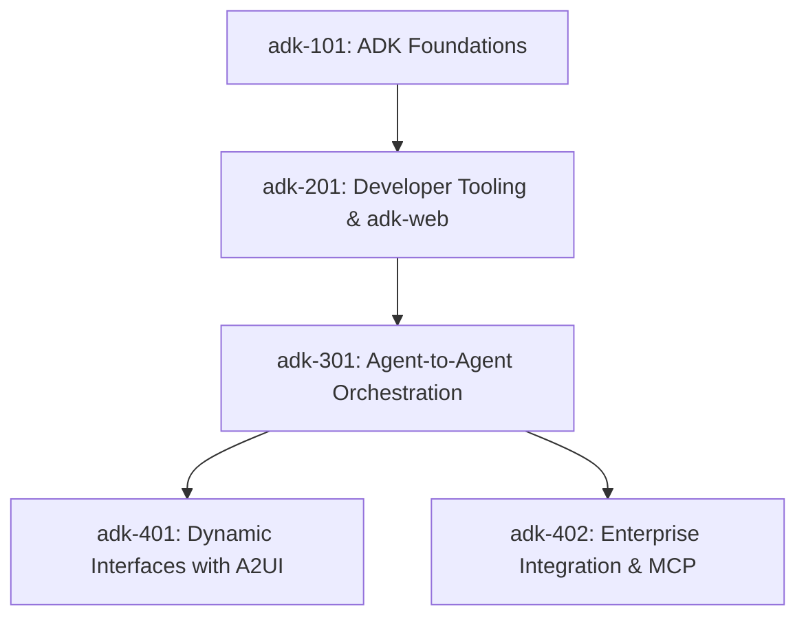

# Curriculum Plan: ADK Development

This document outlines the curriculum architecture, pedagogical progression, and detailed content outlines for the **ADK Development** track in the Tridorian Course Platform catalog.

---

## 1. Track Overview

- **Track ID:** `adk-development`
- **Track Title:** `ADK Development`
- **Track Description:** `Build and deploy production-grade multi-agent systems using Google's Agent Development Kit (ADK), adk-web debugging tools, A2A protocols, and interactive A2UI layouts.`
- **Target Audience:** Agent engineers, software architects, enterprise developers, and technical leads looking to build production-grade multi-agent systems on Google's agent stack.

---

## 2. Pedagogical Progression & Course Matrix

The curriculum follows a linear progression from basic setup and local execution, to advanced multi-agent orchestration, dynamic user interfaces, and enterprise integrations:

### Course Breakdown

1. **`adk-101`: ADK Foundations**
   - *Focus:* CLI installation, agent project instantiation, configuring `agent.yaml`, understanding standard agent structures.
   - *Skills:* CLI operations, config authoring, simple tool integration, local run.
   
2. **`adk-201`: Developer Tooling & adk-web**
   - *Focus:* Visualizing agent executions, local debugging, inspecting memory and tool traces, transaction auditing.
   - *Skills:* Using `adk-web`, execution tracing, state inspections, debugging runtime errors.

3. **`adk-301`: Agent-to-Agent (A2A) Orchestration**
   - *Focus:* Building multi-agent systems. Orchestrating client-server topologies using `A2AServer` and `RemoteA2aAgent`. Implementing agent manifests/cards and secure message routing.
   - *Skills:* Multi-agent routing, network protocols, service discovery, cross-agent communication.

4. **`adk-401`: Dynamic Interfaces with A2UI**
   - *Focus:* Designing dynamic, rich user interfaces powered by agents using the A2UI framework. Rendering structural JSON schemas (cards, forms, lists) securely.
   - *Skills:* A2UI schema definitions, frontend rendering protocols, form input collection, dynamic layouts.

5. **`adk-402`: Enterprise Integration & MCP**
   - *Focus:* Connecting ADK to Model Context Protocol (MCP) servers, OAuth authorization flows, and running agents within secure virtualized sandboxes.
   - *Skills:* MCP tooling, OAuth token handshakes, containerized sandboxing, production deployment architecture.

---

## 3. Technology Reference Guide

### A. Google Agent Development Kit (ADK)
ADK is a code-first framework designed to construct stateful, tool-equipped AI agents. It uses YAML config files to define metadata, capabilities, tools, and constraints:

- `agent.yaml`: Configures the agent model, temperature, system instructions, and links to tools.
- CLI Tool (`adk`):
  - `adk init`: Instantiates a template project.
  - `adk run`: Executes the agent locally.
  - `adk serve`: Exposes the agent as a local service.
  - `adk deploy`: Deploys to a production sandbox.

### B. adk-web
The debugging companion for ADK. Run via `adk dev --web` or `adk-web`, it starts a local visual dashboard that connects to the active agent execution session:
- **Transaction History:** Record and playback step-by-step executions of prompts, model outputs, and tool responses.
- **State Inspector:** View current memory, active variables, and conversation state.
- **Trace Analyzer:** Deep-dive into model latency, token usage, and tool latency metrics.

### C. Agent-to-Agent (A2A)
The protocol suite for multi-agent networking:
- **A2AServer:** Orchestrates communication, handling message queues, encryption, and routing.
- **RemoteA2aAgent:** Connects an agent hosted on a remote server to the orchestrator as if it were local.
- **Agent Cards/Manifests (`agent-card.json`):** Declarative descriptions of an agent's capabilities, inputs, outputs, and endpoints, enabling dynamic discovery.

### D. A2UI (Agent-to-User Interface)
A declarative UI rendering protocol that allows agents to emit interface components instead of raw markdown or text:
- **A2UI Schema:** Standardized JSON layout descriptor.
- **Components:** Supporting cards (key-value lists), input forms (text, dropdowns, buttons), data tables (with sorting), and progress meters.
- **Transport Security:** Ensures rendered interfaces cannot execute malicious code (safe sandboxed rendering).

---

## 4. Course Details & Module Breakdown

### `adk-101`: ADK Foundations
- **Module 1:** Course Introduction & System Requirements (Python 3.10+, Node 18+, Go 1.20+).
- **Module 2:** The ADK CLI & First Project Setup (`adk init`).
- **Module 3:** Deconstructing `agent.yaml` & Config Specifications.
- **Module 4:** Lab: Building Your First Custom Python/TypeScript Tool.
- **Module 5:** Running and Testing Agents Locally (`adk run`).

### `adk-201`: Developer Tooling & adk-web
- **Module 1:** Visual Debugging with `adk-web` Dashboard.
- **Module 2:** Transaction Auditing & Step-by-Step Playbacks.
- **Module 3:** Inspecting Memory & Conversation States.
- **Module 4:** Performance Tracking: Token Usage & Latency Benchmarks.
- **Module 5:** Lab: Debugging a Failing Tool using Trace Analysis.

### `adk-301`: Agent-to-Agent (A2A) Orchestration
- **Module 1:** The Multi-Agent Paradigm & Orchestration Topologies.
- **Module 2:** Launching the `A2AServer` Routing Daemon.
- **Module 3:** Connecting Remote Agents with `RemoteA2aAgent`.
- **Module 4:** Declaring Agent Cards & Manifest Files (`agent-card.json`).
- **Module 5:** Lab: Multi-Agent Collaborative Task (Planner + Executor).

### `adk-401`: Dynamic Interfaces with A2UI
- **Module 1:** Introducing A2UI: Declarative Layouts vs Markdown.
- **Module 2:** Defining Forms, Inputs, and Validation Rules.
- **Module 3:** Rendering Interactive Cards & Structural Tables.
- **Module 4:** Handling User Action Paybacks & Event Routing.
- **Module 5:** Lab: Creating an Agent-Driven Approval Dashboard.

### `adk-402`: Enterprise Integration & MCP
- **Module 1:** Model Context Protocol (MCP) Integration.
- **Module 2:** Configuring OAuth2 for Enterprise APIs.
- **Module 3:** Running headlessly inside sandboxed container nodes.
- **Module 4:** Production Hardening: Security Policies & Audit Trails.
- **Module 5:** Lab: Deploying a Secure Customer Service Orchestrator.
