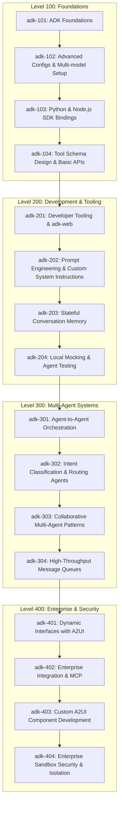

# Curriculum Plan: ADK Development

This document outlines the curriculum architecture, pedagogical progression, and detailed content outlines for the **ADK Development** track in the tridorian Course Platform catalog.

---

## 1. Track Overview

- **Track ID:** `adk-development`
- **Track Title:** `ADK Development`
- **Track Description:** `Build and deploy production-grade multi-agent systems using Google's Agent Development Kit (ADK), adk-web debugging tools, A2A protocols, and interactive A2UI layouts.`
- **Target Audience:** Agent engineers, software architects, enterprise developers, and technical leads looking to build production-grade multi-agent systems on Google's agent stack.

---

## 2. Pedagogical Progression & Course Matrix

The curriculum follows a linear progression from basic setup and local execution, to advanced multi-agent orchestration, dynamic user interfaces, and enterprise integrations:

### Course Breakdown

1. **`adk-101`: ADK Foundations**
   - *Focus:* CLI installation, agent project instantiation, configuring `agent.yaml`, understanding standard agent structures.
   - *Skills:* CLI operations, config authoring, simple tool integration, local run.

2. **`adk-102`: Advanced Configs & Multi-model Setup**
   - *Focus:* Exploring `agent.yaml` parameters, configuring safety settings, model selection, temperature constraints, and context window limits.
   - *Skills:* YAML advanced structures, safety thresholds, multi-model selection.

3. **`adk-103`: Python & Node.js SDK Bindings**
   - *Focus:* Programmatically initializing agents, invoking tool run loops, handling session states, and capturing life-cycle events in code.
   - *Skills:* Programmatic agent scripting, lifecycle hooks, event listener implementation.

4. **`adk-104`: Tool Schema Design & Basic APIs**
   - *Focus:* Designing clean function signatures, utilizing docstrings for LLM reflection, writing strict JSON schemas, and wrapping external APIs.
   - *Skills:* Schema definition, error payload design, API client wrapping.

5. **`adk-201`: Developer Tooling & adk-web**
   - *Focus:* Visualizing agent executions, local debugging, inspecting memory and tool traces, transaction auditing.
   - *Skills:* Using `adk-web`, execution tracing, state inspections, debugging runtime errors.

6. **`adk-202`: Prompt Engineering & Custom System Instructions**
   - *Focus:* Writing structured system guidelines, designing multi-turn examples, managing agent personas, and mitigating hallucination risks.
   - *Skills:* Prompt templating, instruction constraint design, formatting instructions.

7. **`adk-203`: Stateful Conversation Memory**
   - *Focus:* Standardizing conversation history layers, sliding windows, persistent databases (Redis/Postgres), and multi-tenant isolation.
   - *Skills:* Persistence adapter configuration, memory caching, thread state retrieval.

8. **`adk-204`: Local Mocking & Agent Testing**
   - *Focus:* Designing test frameworks for tools, mocking agent decisions, validating conversation pipelines, and measuring regression.
   - *Skills:* Unit testing, LLM response mocking, validation runner setup.

9. **`adk-301`: Agent-to-Agent (A2A) Orchestration**
   - *Focus:* Building multi-agent systems. Orchestrating client-server topologies using `A2AServer` and `RemoteA2aAgent`. Implementing agent manifests/cards and secure message routing.
   - *Skills:* Multi-agent routing, network protocols, service discovery, cross-agent communication.

10. **`adk-302`: Intent Classification & Routing Agents**
    - *Focus:* Building orchestrators that classify query intent, route parameters to downstream agent workers, and handle escalation paths.
    - *Skills:* Intent categorization, worker routing, fallback logic construction.

11. **`adk-303`: Collaborative Multi-Agent Patterns**
    - *Focus:* Architecting blackboards, implementing consensus patterns, staging peer-review checks, and executing sequential pipelines.
    - *Skills:* State blackboards, voting protocols, review loops.

12. **`adk-304`: High-Throughput Message Queues for Agents**
    - *Focus:* Offloading A2A messages to RabbitMQ or Kafka, processing async queues, managing delivery retries, and handling dead-letter archives.
    - *Skills:* Broker configuration, async task worker execution, queue processing.

13. **`adk-401`: Dynamic Interfaces with A2UI**
    - *Focus:* Designing dynamic, rich user interfaces powered by agents using the A2UI framework. Rendering structural JSON schemas (cards, forms, lists) securely.
    - *Skills:* A2UI schema definitions, frontend rendering protocols, form input collection, dynamic layouts.

14. **`adk-402`: Enterprise Integration & MCP**
    - *Focus:* Connecting ADK to Model Context Protocol (MCP) servers, OAuth authorization flows, and running agents within secure virtualized sandboxes.
    - *Skills:* MCP tooling, OAuth token handshakes, containerized sandboxing, production deployment architecture.

15. **`adk-403`: Custom A2UI Component Development**
    - *Focus:* Extending standard A2UI elements with custom React blocks, validating dynamic inputs, and building interactive charting interfaces.
    - *Skills:* React widget writing, schema extension, client event bindings.

16. **`adk-404`: Enterprise Sandbox Security & Isolation**
    - *Focus:* Enforcing system call restrictions, running untrusted agent code in gVisor, managing linux cgroups, and configuring egress firewalls.
    - *Skills:* Kernel-level isolation, network policies, audit trail auditing.

---

## 3. Technology Reference Guide

### A. Google Agent Development Kit (ADK)
ADK is a code-first framework designed to construct stateful, tool-equipped AI agents. It uses YAML config files to define metadata, capabilities, tools, and constraints:

- `agent.yaml`: Configures the agent model, temperature, system instructions, and links to tools.
- CLI Tool (`adk`):
  - `adk init`: Instantiates a template project.
  - `adk run`: Executes the agent locally.
  - `adk serve`: Exposes the agent as a local service.
  - `adk deploy`: Deploys to a production sandbox.

### B. adk-web
The debugging companion for ADK. Run via `adk dev --web` or `adk-web`, it starts a local visual dashboard that connects to the active agent execution session:
- **Transaction History:** Record and playback step-by-step executions of prompts, model outputs, and tool responses.
- **State Inspector:** View current memory, active variables, and conversation state.
- **Trace Analyzer:** Deep-dive into model latency, token usage, and tool latency metrics.

### C. Agent-to-Agent (A2A)
The protocol suite for multi-agent networking:
- **A2AServer:** Orchestrates communication, handling message queues, encryption, and routing.
- **RemoteA2aAgent:** Connects an agent hosted on a remote server to the orchestrator as if it were local.
- **Agent Cards/Manifests (`agent-card.json`):** Declarative descriptions of an agent's capabilities, inputs, outputs, and endpoints, enabling dynamic discovery.

### D. A2UI (Agent-to-User Interface)
A declarative UI rendering protocol that allows agents to emit interface components instead of raw markdown or text:
- **A2UI Schema:** Standardized JSON layout descriptor.
- **Components:** Supporting cards (key-value lists), input forms (text, dropdowns, buttons), data tables (with sorting), and progress meters.
- **Transport Security:** Ensures rendered interfaces cannot execute malicious code (safe sandboxed rendering).

---

## 4. Course Details & Module Breakdown

### `adk-101`: ADK Foundations
- **Module 1:** Course Introduction & System Requirements (Python 3.10+, Node 18+, Go 1.20+).
- **Module 2:** The ADK CLI & First Project Setup (`adk init`).
- **Module 3:** Deconstructing `agent.yaml` & Config Specifications.
- **Module 4:** Lab: Building Your First Custom Python/TypeScript Tool.
- **Module 5:** Running and Testing Agents Locally (`adk run`).

### `adk-102`: Advanced Configs & Multi-model Setup
- **Module 1:** Exploring `agent.yaml` Directives and Schema Options.
- **Module 2:** Configuring safety filters and block thresholds.
- **Module 3:** Temperature, top-k, top-p, and max output tokens.
- **Module 4:** Configuring multi-model backends (Gemini, Claude, GPT).
- **Module 5:** Lab: Multi-Model configuration switcher and model routing.

### `adk-103`: Python & Node.js SDK Bindings
- **Module 1:** Setting up Python ADK SDK bindings.
- **Module 2:** Implementing Node.js ADK SDK bindings.
- **Module 3:** Executing the Agent run loop programmatically.
- **Module 4:** Capturing agent hooks and execution events.
- **Module 5:** Lab: Bootstrapping a custom SDK-based Slack bot.

### `adk-104`: Tool Schema Design & Basic APIs
- **Module 1:** Understanding JSON Schema parameter descriptions.
- **Module 2:** Defining strict Pydantic structures for tool inputs.
- **Module 3:** Creating clean API tool interfaces.
- **Module 4:** Handling tool execution exceptions and returning error payloads.
- **Module 5:** Lab: Writing a structured weather and currency conversion tool.

### `adk-201`: Developer Tooling & adk-web
- **Module 1:** Visual Debugging with `adk-web` Dashboard.
- **Module 2:** Transaction Auditing & Step-by-Step Playbacks.
- **Module 3:** Inspecting Memory & Conversation States.
- **Module 4:** Performance Tracking: Token Usage & Latency Benchmarks.
- **Module 5:** Lab: Debugging a Failing Tool using Trace Analysis.

### `adk-202`: Prompt Engineering & Custom System Instructions
- **Module 1:** Crafting system instructions and behavioral constraints.
- **Module 2:** Implementing few-shot examples in system prompts.
- **Module 3:** Directing the agent output format (Markdown, JSON).
- **Module 4:** Mitigating hallucinations and out-of-boundary queries.
- **Module 5:** Lab: Authoring a structured system instruction suite for a financial advisor.

### `adk-203`: Stateful Conversation Memory
- **Module 1:** Introduction to agent conversation memory paradigms.
- **Module 2:** Windowed conversation histories vs summarization.
- **Module 3:** Persistence layer: Redis and PostgreSQL adapters.
- **Module 4:** Memory isolation in multi-tenant configurations.
- **Module 5:** Lab: Building a stateful memory management agent with session restoration.

### `adk-204`: Local Mocking & Agent Testing
- **Module 1:** Designing unit tests for custom tools.
- **Module 2:** Mocking model responses and external API calls.
- **Module 3:** Automated integration testing for agent conversation flows.
- **Module 4:** Evaluating agent accuracy and regression metrics.
- **Module 5:** Lab: Creating a continuous integration workflow for ADK agents.

### `adk-301`: Agent-to-Agent (A2A) Orchestration
- **Module 1:** The Multi-Agent Paradigm & Orchestration Topologies.
- **Module 2:** Launching the `A2AServer` Routing Daemon.
- **Module 3:** Connecting Remote Agents with `RemoteA2aAgent`.
- **Module 4:** Declaring Agent Cards & Manifest Files (`agent-card.json`).
- **Module 5:** Lab: Multi-Agent Collaborative Task (Planner + Executor).

### `adk-302`: Intent Classification & Routing Agents
- **Module 1:** The Supervisor-Worker design pattern.
- **Module 2:** Building intent classifiers using semantic embedding.
- **Module 3:** Routing messages dynamically to specialized sub-agents.
- **Module 4:** Handling escalation pathways and fallback policies.
- **Module 5:** Lab: Designing a triage routing agent for support requests.

### `adk-303`: Collaborative Multi-Agent Patterns
- **Module 1:** Shared state blackboard architectures.
- **Module 2:** Sequential processing pipelines with intermediate validation.
- **Module 3:** Implementing voting and consensus-based decisions.
- **Module 4:** Conflict resolution and state syncing between agents.
- **Module 5:** Lab: Building a collaborative document drafting team.

### `adk-304`: High-Throughput Message Queues for Agents
- **Module 1:** Scaling A2A networking with broker architectures.
- **Module 2:** Connecting A2AServer to RabbitMQ brokers.
- **Module 3:** Executing long-running asynchronous agent tasks.
- **Module 4:** Delivery guarantees, retries, and dead letter queues.
- **Module 5:** Lab: Building an asynchronous order-processing agent queue.

### `adk-401`: Dynamic Interfaces with A2UI
- **Module 1:** Introducing A2UI: Declarative Layouts vs Markdown.
- **Module 2:** Defining Forms, Inputs, and Validation Rules.
- **Module 3:** Rendering Interactive Cards & Structural Tables.
- **Module 4:** Handling User Action Paybacks & Event Routing.
- **Module 5:** Lab: Creating an Agent-Driven Approval Dashboard.

### `adk-402`: Enterprise Integration & MCP
- **Module 1:** Model Context Protocol (MCP) Integration.
- **Module 2:** Configuring OAuth2 for Enterprise APIs.
- **Module 3:** Running headlessly inside sandboxed container nodes.
- **Module 4:** Production Hardening: Security Policies & Audit Trails.
- **Module 5:** Lab: Deploying a Secure Customer Service Orchestrator.

### `adk-403`: Custom A2UI Component Development
- **Module 1:** Understanding React rendering rules in A2UI.
- **Module 2:** Authoring a custom React-based component library.
- **Module 3:** Binding dynamic client-side interactivity and event loops.
- **Module 4:** Designing rich file uploads and interactive chart widgets.
- **Module 5:** Lab: Implementing a real-time data visualization card.

### `adk-404`: Enterprise Sandbox Security & Isolation
- **Module 1:** Sandboxing strategies: Linux namespaces and cgroups.
- **Module 2:** Configuring gVisor runtime for untrusted tool code.
- **Module 3:** Restricting network egress and system calls.
- **Module 4:** Monitoring, logging, and auditing agent tool executions.
- **Module 5:** Lab: Deploying a hardened gVisor-isolated agent node.
